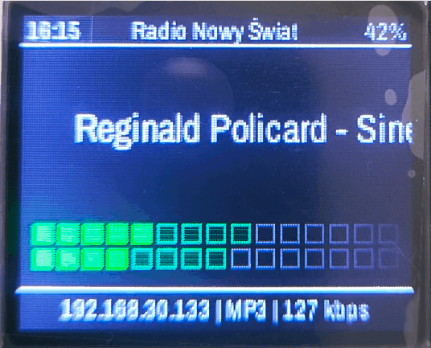

# ESP32 Internet Radio

Internet radio built on ESP32-S3 (Seeed XIAO) with ST7735 160×128 display.

**Version:** 0.1.0

---

## Screenshot



---

## Features

- MP3/AAC internet stream playback
- Station selection screen with carousel (long press encoder)
- Horizontal scrolling for long song titles
- VU Meter — audio level visualization (L+R channel, 15 segments, green/yellow/red)
- Volume control via encoder
- Display: time (NTP), IP address, codec name, bitrate
 - Support for stations without metadata (e.g. Polskie Radio Trójka)
 - Stations managed via `data/stations.txt` on LittleFS — no recompilation needed
 - Web-based station editor — edit stations in the browser, save without reboot

---

## Adding your own stations

Edit `data/stations.txt`:

```
# Format: Station Name|Stream URL
Radio Nowy Swiat|http://stream.nowyswiat.online/mp3
Radio 357|https://stream.radio357.pl/
Your station|http://your-stream-url...
```

Lines starting with `#` are comments. After editing, upload to LittleFS:

```bash
pio run -t uploadfs
```

If `stations.txt` doesn't exist, the radio falls back to built-in defaults.

### Editing stations via Web UI

Once connected to WiFi, open the radio's IP address in a browser (displayed at the bottom of the screen and in Serial Monitor). The page lets you edit the station list — click **Save & Reload** to apply changes immediately without restarting the device.

---

## Usage

| Action | Encoder |
|---|---|
| Rotate CW/CCW | Volume up/down |
| Long press | Toggle playing screen ↔ station list |
| Short press (in list) | Select station |
| Rotate (in list) | Browse stations (carousel) |

---

## Dependencies (PlatformIO)

```
schreibfaul1/ESP32-audioI2S@3.4.5
bodmer/TFT_eSPI@^2.5.43
```

---

## Pinout (Seeed XIAO ESP32S3)

| Function | Pin |
|---|---|---|
| **ST7735 Display** | |
| TFT SCLK | D8 |
| TFT MOSI | D10 |
| TFT DC | D2 |
| TFT RST | D3 |
| TFT CS | D4 |
| **I2S Amplifier** | |
| I2S LRC | D0 |
| I2S BCLK | D9 |
| I2S DOUT | D1 |
| **Encoder** | |
| ENC CLK | D6 |
| ENC DT | D7 |
| ENC SW | D5 |

---

## Building

```bash
pio run             # compile
pio run -t upload   # compile + flash
pio run -t uploadfs # upload files from data/ to LittleFS
pio run -t monitor  # Serial monitor
```

On first boot, LittleFS is automatically formatted. Files from the `data/` directory are uploaded to the LittleFS partition (4 MB).

---

## License

MIT
