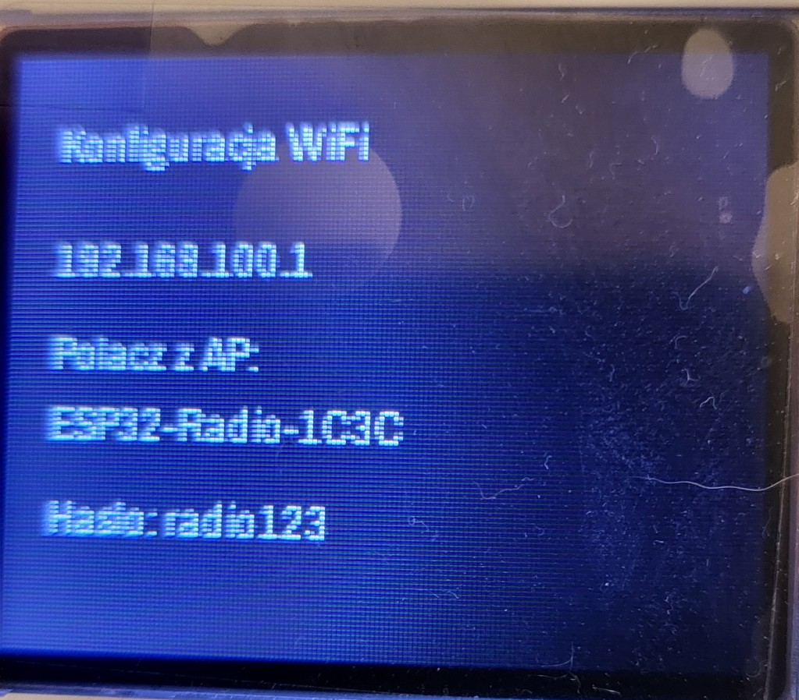
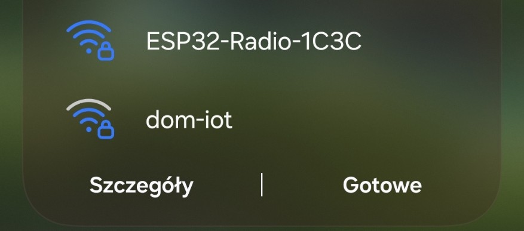
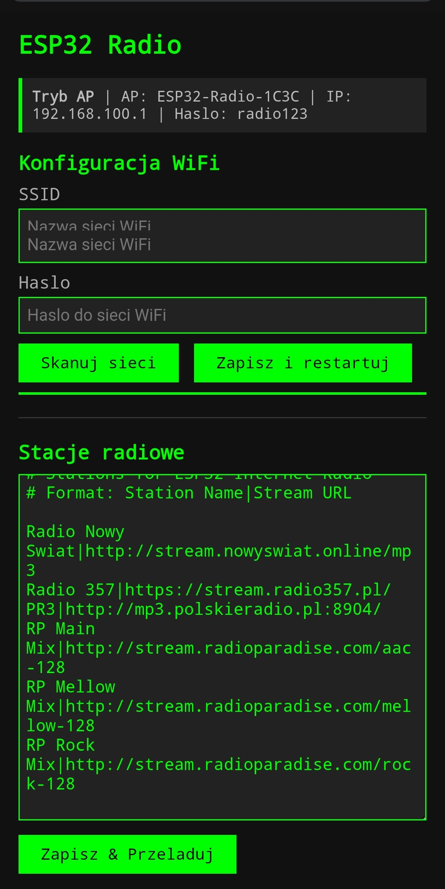
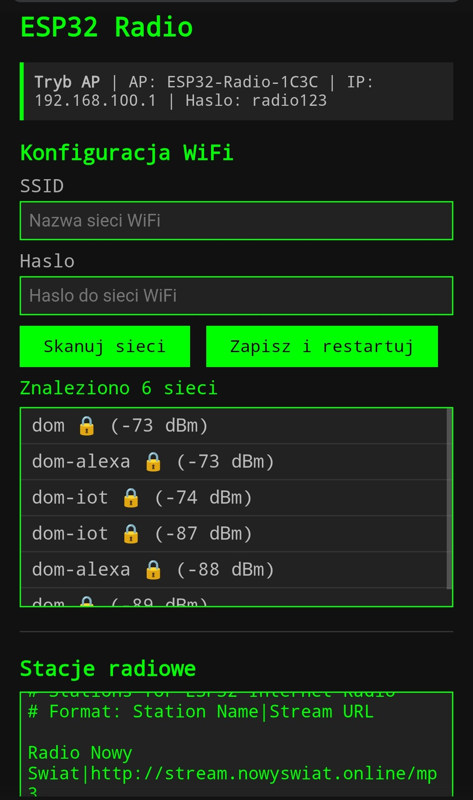

# ESP32 Internet Radio

Internetowe radio na ESP32-S3 (Seeed XIAO) z wyświetlaczem ST7735 160×128.

**Wersja:** 0.3.0

---

## Zrzuty ekranu


### Konfiguracja WiFi przez portal WWW

Ekran w trybie AP (brak konfiguracji WiFi) i formularz konfiguracji:

 

Skanowanie sieci i widok strony w trybie STA:

 

---

## Funkcje

- Odtwarzanie strumieni MP3/AAC z internetu
- Ekran wyboru stacji z karuzelą (długie przytrzymanie enkodera)
- Poziome przewijanie długich tytułów utworów
- VU Meter — wizualizacja poziomu dźwięku (L+P kanał, 15 segmentów, zielony/żółty/czerwony)
- Regulacja głośności enkoderem
- Wyświetlanie czasu (NTP), adresu IP, kodeka i bitrate
- Obsługa stacji bez metadanych (np. Polskie Radio Trójka)
- Stacje konfigurowane przez plik `data/stations.txt` na LittleFS — bez rekompilacji
- Konfiguracja stacji przez interfejs WWW — edytor w przeglądarce, zapis bez restartu
- **Konfiguracja WiFi przez portal webowy** — brak potrzeby podawania SSID/hasła w kodzie

---

## Pierwsze uruchomienie — konfiguracja WiFi

Radio nie wymaga podawania SSID i hasła w kodzie. Przy pierwszym uruchomieniu:

1. Radio sprawdza czy istnieje plik `/wifi.txt` na LittleFS z zapisanymi danymi WiFi
2. Jeśli pliku nie ma (lub dane są błędne) — radio przechodzi w **tryb AP**
3. Na wyświetlaczu LCD pojawia się adres IP `192.168.100.1` oraz nazwa AP `ESP32-Radio-XXXX`
4. Połącz się z siecią `ESP32-Radio-XXXX` (hasło: `radio123`)
5. Otwórz w przeglądarce `http://192.168.100.1`
6. Wpisz SSID i hasło swojej sieci WiFi, kliknij **Zapisz i restartuj**
7. Radio zapisuje konfigurację, restartuje się i łączy z Twoją siecią

Po udanym połączeniu radio działa normalnie — otwórz w przeglądarce adres IP widoczny na pasku stanu strony (na dole ekranu radia), aby edytować stacje lub zmienić WiFi.

**Jeśli połączenie WiFi nie powiedzie się w ciągu 30 sekund** (np. zmieniłeś hasło routera), radio automatycznie wraca do trybu AP, abyś mógł podać poprawne dane.

---

## Jak dodać własne stacje

Edytuj plik `data/stations.txt`:

```
# Format: Nazwa stacji|URL strumienia
Radio Nowy Swiat|http://stream.nowyswiat.online/mp3
Radio 357|https://stream.radio357.pl/
Twoja stacja|http://url-stacji...
```

Linie zaczynające się od `#` to komentarze. Po edycji wgraj plik na LittleFS:

```bash
pio run -t uploadfs
```

Jeśli plik `stations.txt` nie istnieje, radio użyje wbudowanych stacji zapasowych.

### Edycja przez portal WWW

Po połączeniu z WiFi otwórz w przeglądarce adres IP radia (widoczny na dole ekranu i w Serial Monitorze). Ta sama strona umożliwia edycję listy stacji oraz zmianę konfiguracji WiFi. Po kliknięciu **Zapisz & Przeladuj** lista stacji jest natychmiast aktualizowana bez restartu urządzenia.

---

## Jak używać

| Akcja | Enkoder |
|---|---|
| Obrót CW/CCW | Zwiększ/zmniejsz głośność |
| Długie przytrzymanie | Przełącz ekran odtwarzania ↔ lista stacji |
| Krótkie wciśnięcie (na liście) | Wybierz stację |
| Obrót (na liście) | Przeglądanie stacji (karuzela) |

---

## Zależności (PlatformIO)

```
schreibfaul1/ESP32-audioI2S@3.4.5
bodmer/TFT_eSPI@^2.5.43
```

---

## Piny (Seeed XIAO ESP32S3)

| Funkcja | Pin |
|---|---|
| **Wyświetlacz ST7735** | |
| TFT SCLK | D8 |
| TFT MOSI | D10 |
| TFT DC | D2 |
| TFT RST | D3 |
| TFT CS | D4 |
| **Wzmacniacz I2S** | |
| I2S LRC | D0 |
| I2S BCLK | D9 |
| I2S DOUT | D1 |
| **Enkoder** | |
| ENC CLK | D6 |
| ENC DT | D7 |
| ENC SW | D5 |

---

## Budowanie

```bash
pio run             # kompilacja
pio run -t upload   # kompilacja + flash
pio run -t uploadfs # wgranie plików z data/ na LittleFS
pio run -t monitor  # Serial monitor
```

Przy pierwszym uruchomieniu LittleFS zostanie automatycznie sformatowany. Pliki z katalogu `data/` wgrywane są na partycję LittleFS (4 MB).

---

## Licencja

MIT
